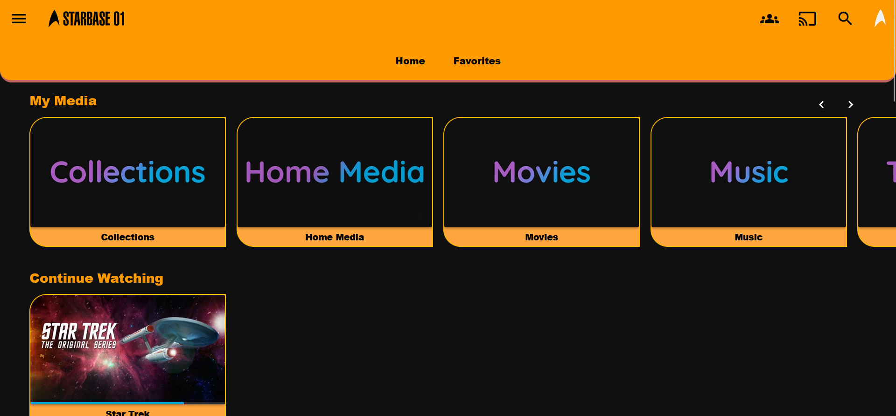

# 🖖 LCARS Jellyfin Theme

A custom [Jellyfin](https://jellyfin.org) theme inspired by the **Library Computer Access/Retrieval System (LCARS)** interface from *Star Trek: The Next Generation*, *Voyager*, and more.

This theme recreates the vibrant, asymmetrical panels, curved lines, and retro-futuristic UI design of Starfleet computers, delivering a fully immersive sci-fi experience for your media server.

## ✨ Features

- Asymmetric LCARS panel styling with curved layout elements  
- Bold segmented blocks and vibrant colors (orange, purple, blue, red, gold)  
- Star Trek-style UI font (LCARS Terminal or Okuda font support)  
- Optimized for readability and responsive display  
- Custom-styled buttons, media cards, navigation menus, and scrollbars  
- Easy to install via Jellyfin's Custom CSS option

## 🖼️ Screenshots

<details>
  <summary>Expand</summary>
  <br/>

  
</details>

## 🎨 Installation

### Option 1: Using Jellyfin’s Custom CSS

1. Go to your **Jellyfin Admin Dashboard**
2. Navigate to: `Dashboard > General > Custom CSS`
3. Paste the contents of [`lcars-theme.css`](./lcars-theme.css) into the field
4. Save and refresh the page

### Option 2: Host as External CSS File

1. Save `lcars-theme.css` on your web server
2. Use browser extensions like **Stylus** to load the theme locally  
3. (Optional) Modify the font path in the CSS to match your hosting environment

## 🔤 Fonts

The theme is designed to use the **LCARS Terminal** or **Okuda** font.

- [LCARS Terminal Font (Free)](https://github.com/remixz/trekkie/blob/master/resources/fonts/LCARS.ttf)
- Include the font with:

```css
@font-face {
  font-family: 'LCARS Terminal';
  src: url('/fonts/lcars.ttf') format('truetype');
}
```

⚠️ You will need to host the font yourself or use a local path.

## ⚙️ Customization Tips

- Modify the color palette in the CSS to suit your variant (e.g., Voyager vs. TNG styles)
- You can add `.lcars-segment` and `.lcars-panel` classes in HTML widgets or browser extensions for enhanced LCARS-like decor
- To extend the theme into mobile views, add media queries

## 🧑‍💻 Contributing
Pull requests and ideas welcome! If you have screenshots, additional layout tweaks, or a variant theme (e.g., Klingon UI, Mirror Universe), feel free to open a PR.

## 🪐 Credits

- Inspired by the LCARS interface designed by Michael Okuda
- Fonts by Nate Piekos / Blambot
- Built for Jellyfin, the open-source media system

## 📜 License

This project is open-source and licensed under the Creative Commons License.
Fonts may have separate licenses — check the font provider before redistribution.
